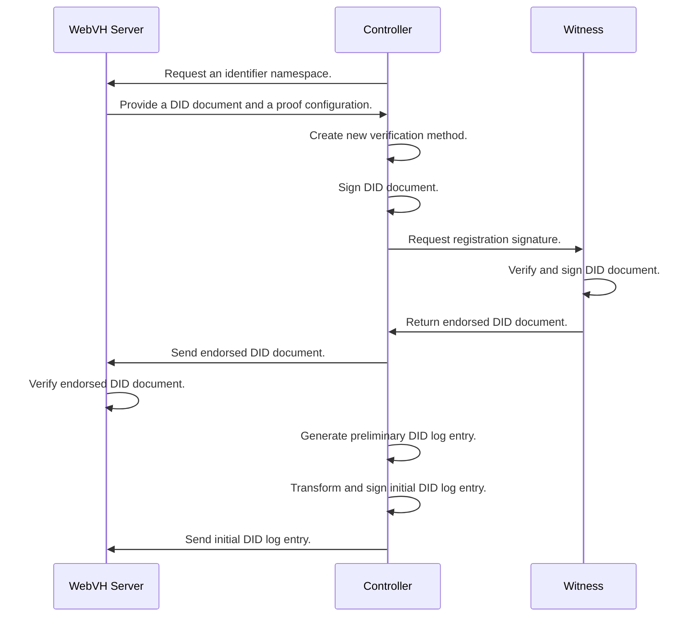

# DID Web with Verifiable History Server Python
## A Web Server component for a DID WebVH implementation

This server is built with the FastAPI framework.

The DID WebVH spec: [https://identity.foundation/didwebvh](https://identity.foundation/didwebvh)

## Abstract

This server is for issuing clients to deposit their did documents, did logs and other objects.

Having a seperate server to deposit verification material will ensure that signing material is isolated and provide a more secured architecture.

This also enables system architects to create rigid governance rules around publishing DID documents and related ressources through endorsment.

## How it works
*For a demonstration, please see the demo directory*

- A controller requests an identifier from the server.
- The server returns a configuration if the requested identifier is available.
- The controller generates an update key and signs a did document for the requested identifier.
- The controller request an registration signature from a witness known to the server.
- The controller sends the did document along with the proof set back to the server.
- The controller generates the preliminary DID log entry, transforms and signs it.
- The controller sends the initial log entry to the server.

### Registering a new DID

### AnonCreds Objects (AttestedResources)

An attested resource is a stored resource cryptographically bound to it's location on the web. See the anoncreds document for more information.

## Roadmap
- whois VP support
