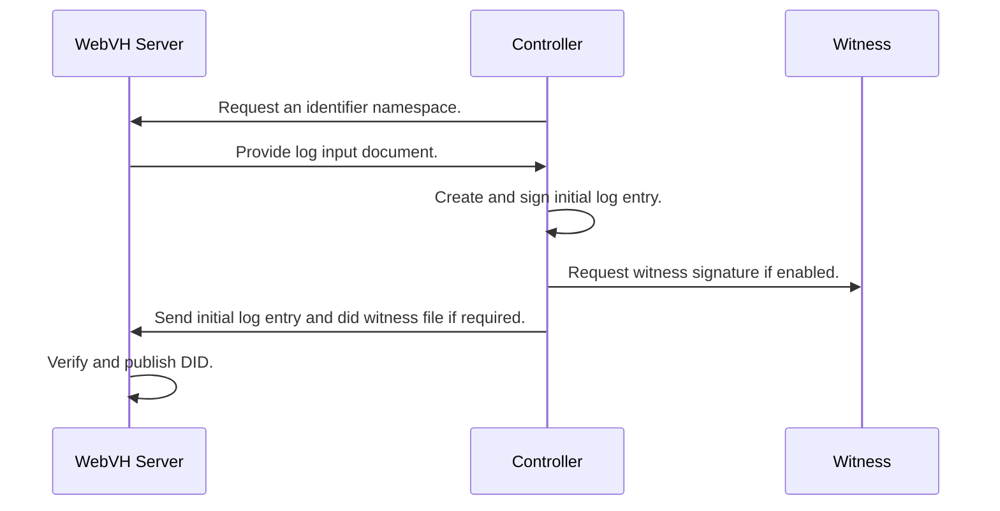

# DID Web with Verifiable History Server Python
## A Web Server component for a DID WebVH implementation

This server is built with the FastAPI framework.

The DID WebVH spec: [https://identity.foundation/didwebvh](https://identity.foundation/didwebvh)

## Abstract

This server is for issuing clients to deposit their did documents, did logs and other objects.

Having a seperate server to deposit verification material will ensure that signing material is isolated and provide a more secured architecture.

This also enables system architects to create rigid governance rules around publishing DID documents and related ressources through endorsment.

## How it works
*For a demonstration, please see the demo directory*

- A controller requests an identifier from the server.
- The server returns a configuration if the requested identifier is available.
- The controller generates a first log entry matching the server policies.
- The controller sends the initial log entry to the server, along with the did witness file if required

### Registering a new DID

### AnonCreds Objects (AttestedResources)

An attested resource is a stored resource cryptographically bound to it's location on the web. See the anoncreds document for more information.

### Setting up policies

The server is equiped with a configurable policy module. Rule sets can be established to change the server behavior when validating some requests.
When a rule is enforced, the server will reject any request that doesn't match said policy. Here are the configurable policies:

#### Known Witnesses Registry

A default known witness key to provision the server. Required if `witnessing` is enforced.
`WEBVH_KNOWN_WITNESS_KEY=z6MQ`

A list of known witnesses is used for validating witness policies. This will be cached every time a witness can't be found.
`WEBVH_KNOWN_WITNESS_REGISTRY=https://known-witnesses.example.com`

#### Attested Resource Endorsement

This will require a known witness proof on any attested resource uploaded or updated. It's up to the witness service to determine which resources to endorse from the controller.
`WEBVH_ENDORSEMENT=true`

#### WebVH Parameters

Require some webvh paramters to be enabled.

##### WebVH Method Version

`WEBVH_VERSION=1.0`

##### Witness

Require a signature from at least 1 known witness.
`WEBVH_WITNESS=true`

##### Watcher

Require a specific watcher to monitor the server.
`WEBVH_WATCHER=https://watcher.example.com`

##### Prerotation

Require prerotation
`WEBVH_PREROTATION=true`

##### Portability

Require portability
`WEBVH_PORTABILITY=true`
