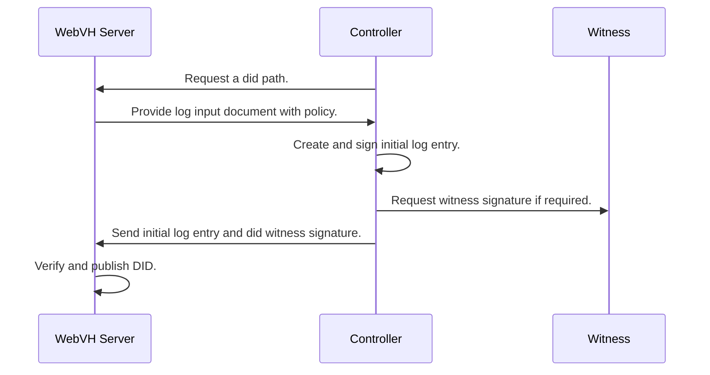

# DID Web with Verifiable History Server Python
## A Web Server component for a DID WebVH implementation

This server is built with the FastAPI framework.

The DID WebVH spec: [https://identity.foundation/didwebvh](https://identity.foundation/didwebvh)

## Abstract

This server is for issuing clients to deposit their did documents, did logs and other objects.

Having a seperate server to deposit verification material will ensure that signing material is isolated and provide a more secured architecture.

This also enables system architects to create rigid governance rules around publishing DID documents and related ressources through endorsment.

## How it works
*For a demonstration, please see the demo directory*

- A controller requests an identifier from the server.
- The server returns a configuration if the requested identifier is available.
- The controller generates a first log entry matching the server policies.
- The controller sends the initial log entry to the server, along with the did witness file if required.

### Registering a new DID


## Server user guide

### 1. Handling DID path requests

When a controller wants to create a new DID, it first asks the server for a **DID path** (domain + namespace + alias).

1. **Request**  
   - The controller sends a `GET` to the base endpoint, for example:  
     `GET {server_url}?namespace={namespace}&alias={alias}`  
   - The server validates that the namespace/alias combination is available and conforms to policy.

2. **Parameters and policy**  
   - If valid, the server returns a JSON document containing:
     - `parameters` – method parameters **plus policy decisions** derived from the configured active policy (see “WebVH Parameters” below), including:
       - `method`: the enforced WebVH method version (from `WEBVH_VERSION`).
       - `witness.threshold` and `witness.witnesses`: witness requirements, based on `WEBVH_WITNESS` and the Known Witness Registry.
       - `watchers`: any mandatory watcher URLs (from `WEBVH_WATCHER`) that must appear in the DID parameters.
       - `portability`: whether portability must be enabled (`WEBVH_PORTABILITY`).
       - `nextKeyHashes`: an empty array when prerotation is enforced (`WEBVH_PREROTATION`), signalling that a `nextKeyHash` must be provisioned.
     - `state.id` – a placeholder DID with the final shape the server will accept, e.g.:  
       `did:webvh:{SCID}:{domain}:{namespace}:{alias}`.

3. **Client obligations**  
   - The controller is expected to **honor the parameters**: any DID creation attempt that violates these server‑defined policies will be rejected when the log entry is submitted.

### 2. Receiving and validating log entries

After applying the parameters, the controller creates the initial log entry and submits it back to the server:

1. **Submission**  
   - The controller calls the log endpoint with something like:  
     `POST {server_url}/{namespace}/{alias}`  
     Body: `{ "logEntry": <history_line>, "witnessSignature": <optional_proof> }`

2. **Verification & policy enforcement**  
   - The server:
     - Verifies the log entry signature(s).
     - Checks the `parameters` inside the log entry against the earlier policy (witness threshold, watchers, portability, prerotation, etc.).
     - Verifies any attached witness proof if `WEBVH_WITNESS` is enabled.

3. **Publishing**  
   - On success, the server:
     - Updates the document state for the DID.
     - Persists the log entry to its append‑only history.
     - Serves the DID and its history via `did.json` / `did.jsonl` for resolvers and controllers.

### 3. Receiving attested resources

The server also accepts **attested resources** that are cryptographically bound to a DID:

1. **Submission**  
   - A controller or witness POSTs to the resources endpoint, for example:  
     `POST {server_url}/{namespace}/{alias}/resources`  
     Body: `{ "attestedResource": <resource_with_proof_and_optional_witness_proof> }`

2. **Policy checks**  
   - If `WEBVH_ENDORSEMENT` is enabled, the server enforces that:
     - The attested resource includes a known witness proof (from the Known Witness Registry).
     - The proof is valid and bound to the correct DID and resource URL.

3. **Storage & retrieval**  
   - On success, the server stores the resource and serves it at a deterministic URL derived from the DID and resource identifier.

### 4. Receiving WHOIS updates

WHOIS data is managed as a special kind of attested resource (a Verifiable Presentation linked to a DID):

1. **Submission**  
   - The controller calls the dedicated WHOIS endpoint:  
     `POST {server_url}/{namespace}/{alias}/whois`  
     Body: `{ "verifiablePresentation": <whois_vp_signed_by_controller> }`

2. **Verification**  
   - The server:
     - Ensures the VP’s `holder` matches the DID path (`did:webvh:...:{namespace}:{alias}`).
     - Verifies the Data Integrity Proof on the VP using the controller’s DID keys.
     - Optionally enforces additional rules (e.g., that embedded VCs are valid and bound to the holder) as policies evolve.

3. **Publishing**  
   - On success, the VP becomes the canonical WHOIS representation for that DID and is exposed through the server’s WHOIS API and/or resolver extensions.

### AnonCreds Objects (AttestedResources)

An attested resource is a stored resource cryptographically bound to it's location on the web. See the anoncreds document for more information.

### Setting up policies

The server is equiped with a configurable policy module. Rule sets can be established to change the server behavior when validating some requests.

When a rule is enforced, the server will reject any request that doesn't match said policy. Here are the configurable policies:

#### Known Witnesses Registry

- WEBVH_KNOWN_WITNESS_KEY: A default known witness key to provision the server.
    - ex: `WEBVH_KNOWN_WITNESS_KEY="z6Mkf5rGMoatrSj1f4CyvuHBeXJELe9RPdzo2PKGNCKVtZxP"`

- WEBVH_KNOWN_WITNESS_REGISTRY: A list of known witnesses is used for validating witness policies. This will be cached every time a witness can't be found.
    - ex: `WEBVH_KNOWN_WITNESS_REGISTRY="https://known-witnesses.example.com"`
- The namespace `innkeeper` is reserved for server-managed Out-of-Band invitation short links (`https://<domain>/innkeeper/invitation?witness={witness_key}&_oobid=<invitation-id>`). These routes are only available when an innkeeper key is configured.
- INNKEEPER_KEY: `publicKeyMultibase` value of the Ed25519 innkeeper key. This value is validated on startup – it must decode to an Ed25519 public key (multibase with the `0xed01` prefix). When provided, the innkeeper API (`/innkeeper`), as well as the invitation shortener endpoints, are enabled and the admin API is disabled for safety. When omitted, all innkeeper endpoints immediately return `503`.
    - ex: `INNKEEPER_KEY="z6MktPGfTmqP3GMMw28MA6D78Mzk7XeiBhbe4nixqhCgE7iX"`
    - See `server/env.example` for a complete environment template.

#### Connecting to a Witness Service

Witnesses advertise their onboarding invitations through the server’s DID document. To connect to a witness:

1. **Collect inputs** – you need the WebVH server base URL (e.g. `https://did.example.org`) and the witness DID (`did:key:z6Mk...`).
2. **Resolve the server DID** – fetch `https://did.example.org/.well-known/did.json`. The document contains a `service` array generated from the known witness registry, plus a `serverPolicy` array exposing the active policy enforced by the server.
3. **Locate the witness entry** – find the service object whose `id` matches the witness DID and whose `type` is `WitnessInvitation`.
4. **Use the short invitation URL** – the service’s `serviceEndpoint` points to `https://<domain>/innkeeper/invitation?witness={witness_multikey}&_oobid=<@id>`. The `_oobid` value comes from the invitation payload’s `@id`.
5. **Follow the redirect** – requesting the short link returns an HTTP 307 redirect back to the original invitation URL (which still contains the full `?oob=...` payload). Supply that destination URL to your agent/connector to initiate the DIDComm relationship.

Because the DID document is derived from the registry, updating the witness entry (via the admin API) automatically refreshes the invitation any controllers discover.

#### Publishing DID Documents with the Innkeeper Key

Use the innkeeper endpoint (`POST /innkeeper/document`) to validate a DID document that was already signed with the innkeeper key:

- `POST /innkeeper/document`
  - Request body: a DID document that includes:
    - a `verificationMethod` entry for the innkeeper, for example:
      ```json
      {
        "id": "did:webvh:{SCID}:example.com#innkeeper",
        "type": "Multikey",
        "controller": "did:webvh:{SCID}:example.com",
        "publicKeyMultibase": "<INNKEEPER_KEY>"
      }
      ```
    - a `capabilityInvocation` relationship referencing that `id`, e.g.:
      ```json
      "capabilityInvocation": [
        "did:webvh:{SCID}:example.com#innkeeper"
      ]
      ```
    - a `capabilityDelegation` relationship also referencing that `id`, e.g.:
      ```json
      "capabilityDelegation": [
        "did:webvh:{SCID}:example.com#innkeeper"
      ]
      ```
    - and a proof on the DID document signed by the innkeeper key.
  - The server verifies the proof using the configured `INNKEEPER_KEY` and returns the validated document unchanged.
  - Requires `INNKEEPER_KEY` to be configured; otherwise the server returns `503`.

In a typical deployment, **controllers do not hold the innkeeper key themselves**. Instead, a governance or operations service (the “innkeeper”) holds the `INNKEEPER_KEY` and acts as a **delegated administrator** for the server, with deliberately restricted powers:

- **Server DID management (restricted)** – the innkeeper can only add or remove `WitnessInvitation` service entries in the server’s DID document; it cannot arbitrarily change other DID metadata or verification methods.
- **Witness service registry** – the innkeeper manages the known witness registry and updates which witness services are advertised through the server’s DID document via those `WitnessInvitation` entries.
- **Server policy management** – the innkeeper sets and updates the WebVH policy environment (`WEBVH_VERSION`, `WEBVH_WITNESS`, `WEBVH_WATCHER`, `WEBVH_PREROTATION`, `WEBVH_PORTABILITY`, `WEBVH_ENDORSEMENT`, etc.) and coordinates any required restarts or redeployments.
- **Onboarding and delegation** – the server’s own DID document lists the innkeeper key in its `capabilityDelegation` section, making the innkeeper the root delegator. During onboarding, the innkeeper performs DID authentication with a tenant’s `did:key`, then issues onboarding credentials (and any required capability grants) to that tenant key so it can interact with the server under the policies that the innkeeper enforces, without ever acting as the server itself or holding the server’s signing keys.
- **Short OOB URLs & proofs** – the innkeeper can request short Out‑of‑Band (OOB) invitation URLs via the `/innkeeper/invitation` endpoint and create Data Integrity Proofs needed to endorse DID documents and resources, but cannot bypass the server’s policy checks.

#### Attested Resource Endorsement

- WEBVH_ENDORSEMENT: This will require a known witness proof on any attested resource uploaded or updated. It's up to the witness service to determine which resources to endorse from the controller.
    - ex: `WEBVH_ENDORSEMENT="true"`

#### WebVH Parameters

The following policy variables can be used to enforce parameters from the did:webvh specification:
- WEBVH_VERSION: Specify a webvh method version to enforce
    - ex: `WEBVH_VERSION="1.0"`
- WEBVH_WITNESS: Enforce the use of witness with a minimum threshold of 1. At least 1 witness from the known witness registry will need to be used.
    - ex: `WEBVH_WITNESS="true"`
- WEBVH_PORTABILITY: Ensure that portability is enabled.
    - ex: `WEBVH_PORTABILITY="true"`
- WEBVH_WATCHER: Request a specific watcher to be included in the watchers array
    - ex: `WEBVH_WATCHER=https://watcher.example.com`
- WEBVH_PREROTATION: Enforce the use of prerotation
    - ex: `WEBVH_PREROTATION="true"`

### Exploring the resources

Have a look at the demo directory for instructions on how to browse the explorer.