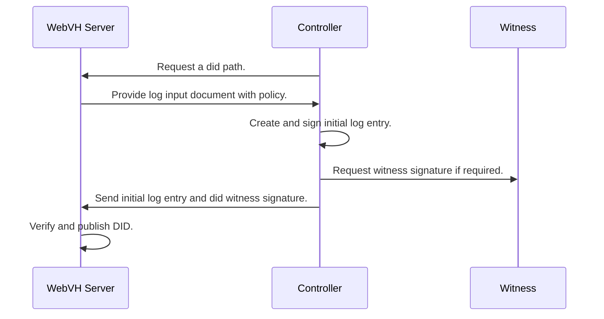

# DID Web with Verifiable History Server Python

A Web Server component for a DID WebVH implementation built with FastAPI.

**DID WebVH Specification**: [https://identity.foundation/didwebvh](https://identity.foundation/didwebvh)

## Abstract

This server enables controllers to deposit their DID documents, DID logs, and attested resources (including AnonCreds objects) in a secure, policy-driven environment.

By separating the storage of verification material from the signing operations, the architecture provides:
- **Security**: Signing material isolation
- **Governance**: Configurable policies for witness requirements, endorsement, portability, and more
- **Verifiability**: Cryptographic proofs and append-only history
- **Interoperability**: Support for AnonCreds, W3C Verifiable Credentials, and DID Attested Resources

## How It Works

The DID WebVH Server follows a policy-driven approach where controllers request DID paths, receive policy parameters, and submit signed log entries for verification and publication.

### Key Workflow

1. **Controller requests a DID path** from the server
2. **Server returns policy-driven parameters** that must be used
3. **Controller creates and signs** the initial log entry
4. **Controller obtains witness signatures** (if required by policy)
5. **Controller submits** the log entry with witness proofs
6. **Server verifies and publishes** the DID document and history

### Registering a New DID



## Features

- **DID Management**: Create, resolve, and manage DIDs with WebVH method
- **Attested Resources**: Upload and manage AnonCreds objects, schemas, credential definitions
- **Witness Registry**: Manage known witness services and their invitation URLs
- **Policy Enforcement**: Configurable policies for witness, endorsement, portability, prerotation
- **Web Explorer**: Interactive UI for browsing DIDs, resources, and witness network
- **Multiple Storage**: SQLite (default) or PostgreSQL backends

## Quick Start

See [`server/README.md`](server/README.md) for detailed setup instructions.

```bash
# Install dependencies
cd server
uv sync

# Copy and configure environment
cp env.example .env
# Edit .env with your settings

# Run server
uv run python main.py
```

## Documentation

📚 **For complete documentation, see the [User Manual](docs/content/index.md)**

The user manual includes:
- **Getting Started**: Installation and setup
- **Configuration**: All environment variables and settings
- **API Endpoints**: Complete API reference
- **Protocols**: Detailed protocol flows (Connecting to Witness, Requesting DID Path, Creating Log Entry)
- **Roles**: Admin, Witness, Controller, and Watcher responsibilities
- **Admin Operations**: Managing witnesses and policies
- **DID Operations**: Creating, updating, and resolving DIDs
- **AnonCreds**: Publishing and resolving AnonCreds objects
- **Examples**: Practical use cases

## Additional Resources

- **[Server README](server/README.md)**: Quick setup guide for the server
- **Interactive API Docs**: Swagger UI available at `/docs` when server is running
- **Demo**: See the `demo/` directory for example usage

## Project Structure

```
didwebvh-server-py/
├── server/              # FastAPI server application
│   ├── app/
│   │   ├── routers/    # API route handlers
│   │   ├── plugins/    # Core plugins
│   │   └── templates/  # Web explorer UI
│   └── env.example     # Environment configuration template
├── docs/               # User manual and documentation
└── demo/               # Demonstration examples
```

## License

Apache License 2.0