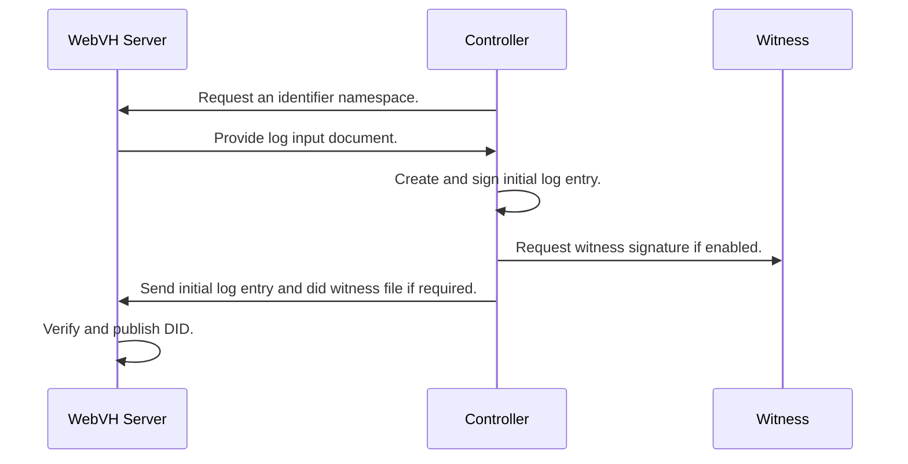

# DID Web with Verifiable History Server Python
## A Web Server component for a DID WebVH implementation

This server is built with the FastAPI framework.

The DID WebVH spec: [https://identity.foundation/didwebvh](https://identity.foundation/didwebvh)

## Abstract

This server is for issuing clients to deposit their did documents, did logs and other objects.

Having a seperate server to deposit verification material will ensure that signing material is isolated and provide a more secured architecture.

This also enables system architects to create rigid governance rules around publishing DID documents and related ressources through endorsment.

## How it works
*For a demonstration, please see the demo directory*

- A controller requests an identifier from the server.
- The server returns a configuration if the requested identifier is available.
- The controller generates a first log entry matching the server policies.
- The controller sends the initial log entry to the server, along with the did witness file if required

### Registering a new DID

### AnonCreds Objects (AttestedResources)

An attested resource is a stored resource cryptographically bound to it's location on the web. See the anoncreds document for more information.

### Setting up policies

The server is equiped with a configurable policy module. Rule sets can be established to change the server behavior when validating some requests.

When a rule is enforced, the server will reject any request that doesn't match said policy. Here are the configurable policies:

#### Known Witnesses Registry

- WEBVH_KNOWN_WITNESS_KEY: A default known witness key to provision the server.
    - ex: `WEBVH_KNOWN_WITNESS_KEY="z6Mkf5rGMoatrSj1f4CyvuHBeXJELe9RPdzo2PKGNCKVtZxP"`

- WEBVH_KNOWN_WITNESS_REGISTRY: A list of known witnesses is used for validating witness policies. This will be cached every time a witness can't be found.
    - ex: `WEBVH_KNOWN_WITNESS_REGISTRY="https://known-witnesses.example.com"`

#### Connecting to a Witness Service

Witnesses advertise their onboarding invitations through the server’s DID document. To connect to a witness:

1. **Collect inputs** – you need the WebVH server base URL (e.g. `https://did.example.org`) and the witness DID (`did:key:z6Mk...`).
2. **Resolve the server DID** – fetch `https://did.example.org/.well-known/did.json`. The document contains a `service` array generated from the known witness registry.
3. **Locate the witness entry** – find the service object whose `id` matches the witness DID and whose `type` is `WitnessInvitation`.
4. **Use the invitation URL** – the service’s `serviceEndpoint` field is the witness’ invitation URL. Present it to your agent/connector to initiate the DIDComm relationship with that witness.

Because the DID document is derived from the registry, updating the witness entry (via the admin API) automatically refreshes the invitation any controllers discover.

#### Attested Resource Endorsement

- WEBVH_ENDORSEMENT: This will require a known witness proof on any attested resource uploaded or updated. It's up to the witness service to determine which resources to endorse from the controller.
    - ex: `WEBVH_ENDORSEMENT="true"`

#### WebVH Parameters

The following policy variables can be used to enforce parameters from the did:webvh specification:
- WEBVH_VERSION: Specify a webvh method version to enforce
    - ex: `WEBVH_VERSION="1.0"`
- WEBVH_WITNESS: Enforce the use of witness with a minimum threshold of 1. At least 1 witness from the known witness registry will need to be used.
    - ex: `WEBVH_WITNESS="true"`
- WEBVH_PORTABILITY: Ensure that portability is enabled.
    - ex: `WEBVH_PORTABILITY="true"`
- WEBVH_WATCHER: Request a specific watcher to be included in the watchers array
    - ex: `WEBVH_WATCHER=https://watcher.example.com`
- WEBVH_PREROTATION: Enforce the use of prerotation
    - ex: `WEBVH_PREROTATION="true"`

### Exploring the resources

Have a look at the demo directory for instructions on how to browse the explorer.