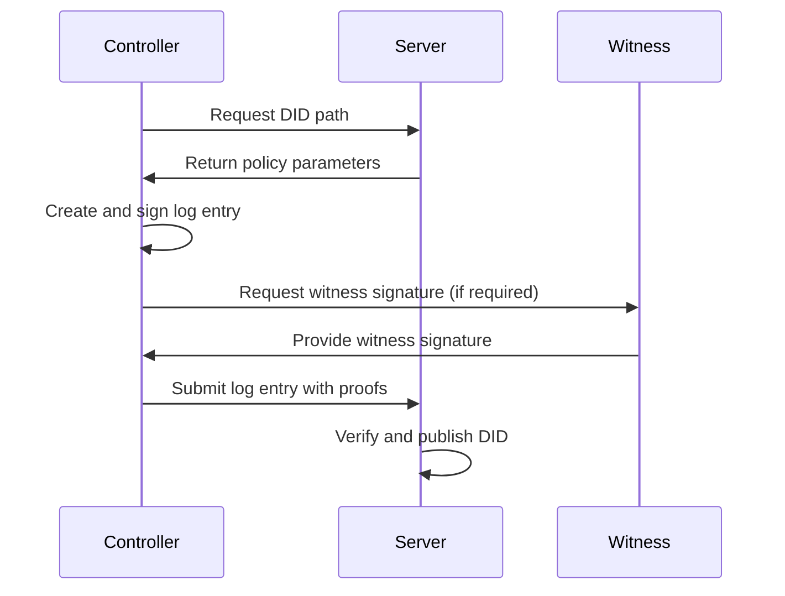

# About

The DID WebVH Server is a FastAPI-based server for managing Decentralized Identifiers (DIDs) using the WebVH (Web Verifiable History) method. It provides endpoints for creating, updating, and resolving DIDs, as well as managing witness services and server policies.

## What is DID WebVH?

**DID WebVH** (Decentralized Identifier Web Verifiable History) is a DID method specification that provides a secure, policy-driven approach to managing Decentralized Identifiers on the web.

This server implementation enables controllers to deposit their DID documents, DID logs, and attested resources (including AnonCreds objects) in a secure, policy-driven environment.

## Key Benefits

### 🔒 Security

By separating the storage of verification material from the signing operations, the architecture provides:

- **Signing Material Isolation**: Signing keys remain with controllers and witnesses, not on the server
- **Cryptographic Proofs**: All operations are cryptographically verified
- **Append-Only History**: Immutable log entries ensure verifiable history

### ⚖️ Governance

Configurable policies allow you to control:

- **Witness Requirements**: Require witness signatures for DID operations
- **Endorsement Policies**: Control which resources and credentials need endorsement
- **Portability**: Enable or disable DID portability features
- **Prerotation**: Configure key rotation policies

### 📜 Verifiability

- **Cryptographic Verification**: All log entries are cryptographically signed
- **Append-Only Logs**: Immutable history ensures auditability
- **Version Control**: Track all changes to DID documents over time

### 🔗 Interoperability

Full support for:

- **AnonCreds**: Publish and resolve AnonCreds schemas and credential definitions
- **W3C Verifiable Credentials**: Support for standard VC formats
- **DID Attested Resources**: Manage any type of attested resource

## Architecture

The DID WebVH Server follows a policy-driven workflow:

## Components

### Server

The server component is responsible for:

- **Policy Management**: Enforcing configurable policies for DID operations
- **Verification**: Verifying signatures and proofs from controllers and witnesses
- **Storage**: Hosting DID documents (`did.json`) and log files (`did.jsonl`)
- **Resource Management**: Managing attested resources and their metadata

### Controller

The controller role:

- **Creates DIDs**: Requests DID paths and creates initial log entries
- **Updates DIDs**: Submits signed log entries for updates
- **Manages Resources**: Uploads and manages attested resources
- **Interacts with Witnesses**: Requests witness signatures when required

### Witness

The witness role:

- **Signs Operations**: Provides cryptographic signatures for DID operations
- **Endorses Resources**: Endorses attested resources and verifiable credentials
- **Verifies Requests**: Validates controller requests before signing

### Watcher

The watcher role (optional):

- **Monitors Changes**: Watches for DID document and log changes
- **Receives Notifications**: Gets notified of updates and new resources
- **Audit Trail**: Maintains audit logs of all operations

## Key Features

- **DID Creation and Management**: Create and manage DIDs with verifiable history
- **Witness Services**: Integrate with witness services for DID attestation
- **Policy Enforcement**: Configurable policies for witness requirements, portability, prerotation, and more
- **Admin API**: Administrative endpoints for managing witnesses and policies
- **Resource Management**: Store and serve attested resources bound to DIDs
- **Web Explorer**: Interactive web interface for browsing DIDs, resources, and witness network
- **AnonCreds Support**: Publish and resolve AnonCreds objects as Attested Resources

## Technology Stack

- **Framework**: FastAPI (Python)
- **Database**: SQLite or PostgreSQL
- **Storage**: Configurable storage backends
- **API**: RESTful API with OpenAPI documentation
- **Web UI**: Modern web explorer interface

## Specification

This server implements the [DID WebVH Specification](https://identity.foundation/didwebvh) maintained by the Decentralized Identity Foundation (DIF).

## License

This project is open source and available under the Apache 2.0 License.

## Community

- **Repository**: [GitHub](https://github.com/decentralized-identity/didwebvh-server-py)
- **Issues**: [GitHub Issues](https://github.com/decentralized-identity/didwebvh-server-py/issues)
- **Discussions**: [GitHub Discussions](https://github.com/decentralized-identity/didwebvh-server-py/discussions)

## Getting Started

Ready to get started? Check out our [Getting Started Guide](getting-started.md) or explore the [User Guide](user-manual.md) for comprehensive documentation.

